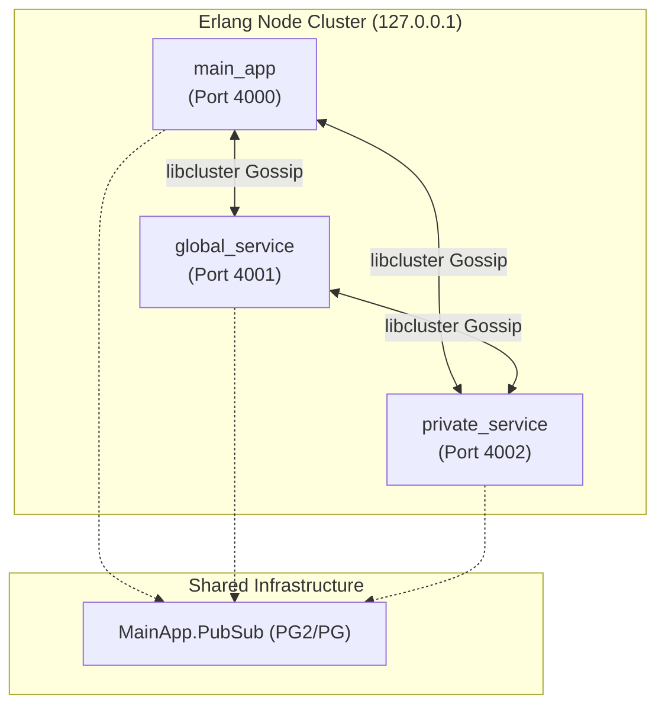
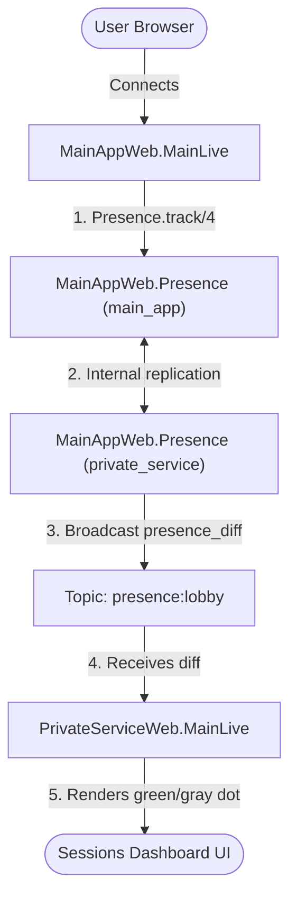

# Independent Phoenix LiveView Micro-UIs Experiment

## Motivation

- allow multiple teams to deploy parts of a LiveView independently with maximum simplicity
- there's no settled optimum yet, ideas are welcome

## Current Architecture

- 3 independent nodes connected in a cluster
- [main_app](./main_app/) acts as the front-end, serving the [main page](main_app/lib/main_app_web/live/main_live.ex)
- [global_service](./global_service/) and [private_service](./private_service/) [push rendered partial LiveViews](private_service/lib/private_service/private_click_aggregator_service.ex) into Pub/Sub, to which the `main_app` is subscribed, rendering them as they are, within the main view.
- the services also expose their own LiveViews for e.g. their "admin" purposes

### Architecture at a Glance

#### 1. Cluster Topology & Network (High Level)
Shows how the 3 independent service nodes form a cluster and communicate using a shared clustered PubSub adapter.

#### 2. Click Interaction & HTML UI Update Flow
Shows the path of a click event and how micro-UI partial views are rendered and updated back to the user.

#### 3. Session Presence & Status Tracking
Shows how Phoenix Presence tracks session IDs and replicates their online/offline state across nodes.

### Challenges

- very chatty/wasteful:
  - rendered partial HTML views are sent from the services, instead of the optimized configuration as known in LiveView
- current docker compose / libcluster config creates a sporadically disconnected cluster
- presence messages seem to not reach the services
  - work-around: when a main LiveView is mounted, a custom `hi` message is published into the `arrivals` channel, requesting a rendered UI from the services.

### Pending Ideas

- 3 LiveView sockets
  - potentially served via the same reverse proxy under different paths
- other approaches, unifying the LiveView socket?
- when a service goes doesn / hasn't sent updates in a while, show a `currently unavailable` message in the main view
  - custom monitor?
  - custom scheduled messages to `self()` in main LiveView?

### Failed Approaches

- trying to render the diffs only:
  - unfortunately, this failed with the diff (?) functions not being present on the `main_app`

## Start with process-compose

- install [process-compose](https://f1bonacc1.github.io/process-compose/installation/)
- `process-compose``
- &rarr; http://localhost:4000
  - http://localhost:4001
  - http://localhost:4002

## Start with docker compose

- `docker compose up` (with other options depending on the needs)
- &rarr; http://localhost:4001
  - http://localhost:4001/services/global
  - http://localhost:4001/services/private